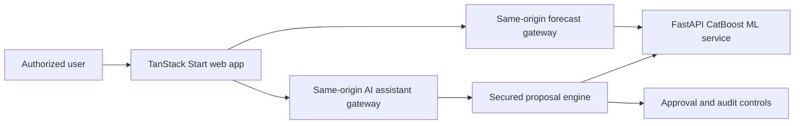

# SurplusSync Plus

[](https://github.com/mahmoud-yassin10/surplussync-platform/actions/workflows/platform-validation.yml)


**Uncertainty-aware school meal forecasting and human-approved surplus recovery.**

SurplusSync Plus helps school cafeterias reduce avoidable overproduction without creating unacceptable shortage risk. It combines CatBoost attendance forecasting, quantile uncertainty estimates, explicit safety floors, human approval gates, partner-recovery safeguards, and lifecycle-aware impact tracking.

**USAII Global AI Hackathon 2026 - High School Track**  
**Approval code:** `USAII-2026-L7YYDP`

## Overview

SurplusSync Plus is an AI-assisted operational prototype for school cafeterias. It forecasts likely meal participation, shows uncertainty, recommends a safer preparation quantity, and supports a controlled workflow for surplus recovery. The AI assistant explains and simulates; authorized humans approve operational actions.

The repository is a judge-facing monorepo snapshot assembled from three verified source repositories. Development history remains in the original repositories listed in [source provenance](docs/SOURCE_PROVENANCE.md).

## The Problem

School cafeterias often prepare meals before the day fully unfolds. Field trips, exams, weather, early dismissal, menu popularity, and recent attendance trends can all change demand. Preparing too much can create avoidable waste; preparing too little can create shortage risk for students. Even when surplus exists, recovery is operationally difficult because food-safety checks, pickup windows, partner eligibility, and staff approval all matter.

## The Solution

```text
Forecast attendance
-> quantify uncertainty
-> recommend a safe preparation quantity
-> require human approval
-> confirm actual surplus and food-safety prerequisites
-> identify an eligible recovery partner
-> track projected and confirmed impact separately
```

## Key Capabilities

- Command Center for the canonical school-day workflow.
- Forecast Horizon Ribbon and uncertainty interval.
- Decision Canvas for preparation tradeoffs.
- Explicit safety floor and safety buffer.
- What-if attendance correction simulation.
- Approval Gate before consequential actions.
- Secured AI assistant proposal layer.
- Strict manual mode.
- Server-enforced partner prerequisites.
- Live MapLibre recovery map with schematic fallback.
- Audit Storyline for append-only operational history.
- Impact lifecycle tracking.
- Estimated carbon ledger.
- Deterministic fallback when optional Gemini generation is unavailable.

## Why AI Is Used

CatBoost models learn interactions across structured school-day factors such as trips, exams, weather, menu popularity, enrollment, and recent attendance. Quantile regressors estimate a lower and upper attendance range, and what-if simulation recomputes outcomes when operational assumptions change.

The AI assistant does not create the attendance forecast. It translates operational questions into explanations, simulations, and pending proposals. Deterministic server policies still govern safety, authorization, stale proposal checks, partner prerequisites, and approval.

## System Architecture



Browser code talks to same-origin app routes. Service URLs, service tokens, and the optional Gemini key stay server-side. The frontend gateway calls the ML service; the AI assistant gateway reconciles main-app state, creates pending proposals, and relies on explicit approval endpoints for execution.

## Repository Structure

| Path | Purpose |
| --- | --- |
| `apps/web` | TanStack Start frontend and same-origin gateways |
| `services/copilot-api` | Secured AI assistant proposal and explanation service |
| `services/ml-api` | FastAPI CatBoost forecasting service and model artifacts |
| `docs` | Judge-facing architecture, safety, model, testing, and methodology docs |
| `scripts` | Local startup, shutdown, verification, and validation helpers |
| `.github/workflows` | Root monorepo CI |

## Five-Minute Quick Start

### Prerequisites

- Windows PowerShell 7 or Windows PowerShell 5.1
- Bun 1.3.14 or compatible
- Node.js 22
- Python 3.13

### Windows PowerShell

```powershell
Copy-Item .env.example .env

cd services/ml-api
py -3.13 -m venv .venv
.\.venv\Scripts\Activate.ps1
python -m pip install --upgrade pip
python -m pip install -e ".[dev]"
deactivate
cd ..\..

cd services/copilot-api
npm ci
cd ..\..

cd apps/web
bun install --frozen-lockfile
cd ..\..

.\scripts\start.ps1
.\scripts\verify.ps1
```

Open the frontend URL printed by `scripts/start.ps1`. Vite prints the active port if `3000` is unavailable.

### Linux/macOS

```bash
cp .env.example .env

cd services/ml-api
python3.13 -m venv .venv
source .venv/bin/activate
python -m pip install --upgrade pip
python -m pip install -e ".[dev]"
deactivate
cd ../..

cd services/copilot-api && npm ci && cd ../..
cd apps/web && bun install --frozen-lockfile && cd ../..
```

Use the per-service run commands in [Quickstart](docs/QUICKSTART.md) on non-Windows systems.

## Service Ports

- ML API: `8000`
- AI assistant API: `3001`
- Frontend: Vite default, normally `3000`; Vite prints the active port.

## Environment Variables

Root `.env.example` documents local defaults for all services. `GEMINI_API_KEY` is optional. Without it, the AI assistant uses the deterministic fallback for language generation while forecast data still comes from the ML service.

No server secret uses a `VITE_` prefix.

For durable Copilot sessions on Vercel, configure `UPSTASH_REDIS_REST_URL` and `UPSTASH_REDIS_REST_TOKEN` in the Copilot project. Local development and CI use in-memory session fallback when Redis is absent. Redis, Gemini, and service-token secrets must never be exposed to browser code.

## Vercel Deployment

Deploy this monorepo as three Vercel projects:

### Frontend Project

Root directory: `apps/web`

```env
ML_SERVICE_URL=https://YOUR-ML-PROJECT.vercel.app
ML_REQUEST_TIMEOUT_MS=8000
ALLOW_FORECAST_FALLBACK=true

COPILOT_SERVICE_URL=https://YOUR-COPILOT-PROJECT.vercel.app
COPILOT_SERVICE_TOKEN=GENERATE_A_STRONG_RANDOM_VALUE
COPILOT_REQUEST_TIMEOUT_MS=10000
COPILOT_ALLOW_FORECAST_FALLBACK=true
MAIN_APP_SERVICE_TOKEN=GENERATE_A_SECOND_STRONG_RANDOM_VALUE
```

`COPILOT_SERVICE_TOKEN` is read only by the frontend server gateway and sent as the bearer token to the Copilot API. It must exactly match the Copilot project's `MAIN_APP_SERVICE_TOKEN`. The frontend project's `MAIN_APP_SERVICE_TOKEN` is only used for local script parity and should not be exposed to the browser.

### ML Project

Root directory: `services/ml-api`

```env
ALLOW_DEMO_FIXTURE=true
```

### Copilot Project

Root directory: `services/copilot-api`

```env
NODE_ENV=production
ML_SERVICE_URL=https://YOUR-ML-PROJECT.vercel.app
COPILOT_ALLOW_FORECAST_FALLBACK=true
MAIN_APP_SERVICE_TOKEN=THE_VALUE_SENT_BY_FRONTEND_COPILOT_SERVICE_TOKEN
UPSTASH_REDIS_REST_URL=YOUR_UPSTASH_URL
UPSTASH_REDIS_REST_TOKEN=YOUR_UPSTASH_TOKEN
COPILOT_SESSION_TTL_SECONDS=86400
GEMINI_API_KEY=
```

`GEMINI_API_KEY` remains optional. Without it, deterministic language fallback is used.

## Canonical Demo

School: Lincoln Heights Public High School  
Date: Thursday, 2026-03-12

Baseline:

- normal preparation: 730
- expected attendance: 528
- interval: 497-557
- recommendation: 562
- preventable surplus: 168
- shortage probability: 4.1%
- risk: high

Corrected scenario:

- attendance: 540
- interval: 512-568
- recommendation: 575
- preventable surplus: 155
- shortage probability: 3.4%
- safety floor: 540
- safety buffer: 7

These official demo values are contract-locked for reproducibility across the UI, tests, narration, screenshots, and video.

## Guided Demonstration

1. Open Command Center.
2. Select the canonical Thursday.
3. Inspect uncertainty and recommendation.
4. Open evidence.
5. Ask the AI assistant why Thursday is high risk.
6. Run the field-trip cancellation simulation.
7. Confirm simulation does not mutate operational state.
8. Create an attendance proposal.
9. Approve it as an authorized user.
10. Review corrected recommendation.
11. Attempt partner selection before prerequisites.
12. Complete prerequisites.
13. Approve partner selection.
14. Review Impact Ledger and audit history.
15. Test strict manual mode.
16. Reset demo.

## Running Tests

Root helper:

```powershell
.\scripts\test-all.ps1
```

Frontend:

```powershell
cd apps/web
bun install --frozen-lockfile
bunx tsc --noEmit
bun run test:run
bun run build
```

Copilot:

```powershell
cd services/copilot-api
npm ci
npm run lint
npm test
npm run build
```

ML:

```powershell
cd services/ml-api
py -3.13 -m venv .venv
.\.venv\Scripts\Activate.ps1
python -m pip install -e ".[dev]"
pytest
ruff check .
mypy src
python -m surplussync_ml.bootstrap
```

## ML Explanation

The ML service uses three CatBoost regressors: a point attendance model, a q10 model, and a q90 model. Inputs include weekday, calendar month, enrollment, eligibility, trips, exams, early dismissal, weather, menu popularity, and recent attendance. The recommendation policy uses the point estimate, the upper uncertainty estimate, a safety buffer, a safety floor, and an eligibility cap.

Current training data is synthetic. The canonical demo fixture is deterministic and contract-locked. Shortage probability is currently heuristic for general predictions, and the preparation policy is safety-oriented rather than a full newsvendor optimizer.

## Responsible AI and Safety

The AI assistant cannot approve itself, contact partners, reserve capacity, schedule pickups, delete audit history, or bypass strict manual mode. Consequential actions require role authorization and explicit human approval. Partner execution is checked server-side against surplus confirmation, checklist completion, recovery windows, partner eligibility, proposal freshness, operating mode, and cancellation/reset conflicts.

The app discloses synthetic data, fallback behavior, uncertainty, and demo limitations. It does not use private student-level data.

## Impact Methodology

Impact is lifecycle-aware: forecast, proposed, approved, scheduled, and confirmed are kept separate. Values are labeled as observed, calculated, projected, or synthetic/demo where applicable. A recommendation is not automatically confirmed meals saved. See [Impact Methodology](docs/IMPACT_METHODOLOGY.md).

## Carbon Methodology

Carbon impact is estimated, not measured. The current method assumes 1.2 lb per meal, converts pounds to kilograms, and applies a ReFED-derived scenario factor. It distinguishes projected and confirmed impact and is not audited carbon accounting. See [Impact Methodology](docs/IMPACT_METHODOLOGY.md).

## Known Limitations

- Synthetic training data.
- Deterministic canonical fixture.
- Heuristic shortage probability.
- Safety-oriented preparation policy rather than a full newsvendor optimizer.
- No production identity provider.
- No durable enterprise database.
- Carbon estimate is not audited.
- No real Chicago school performance claim.

## Source Provenance

See [Source Provenance](docs/SOURCE_PROVENANCE.md).

## License and Attribution

No unified repository license has been selected yet. The imported ML package metadata declares MIT, but the frontend and AI assistant repositories did not include root license files in the verified snapshots. See [LICENSE](LICENSE) and [Third-Party Notices](THIRD_PARTY_NOTICES.md).
