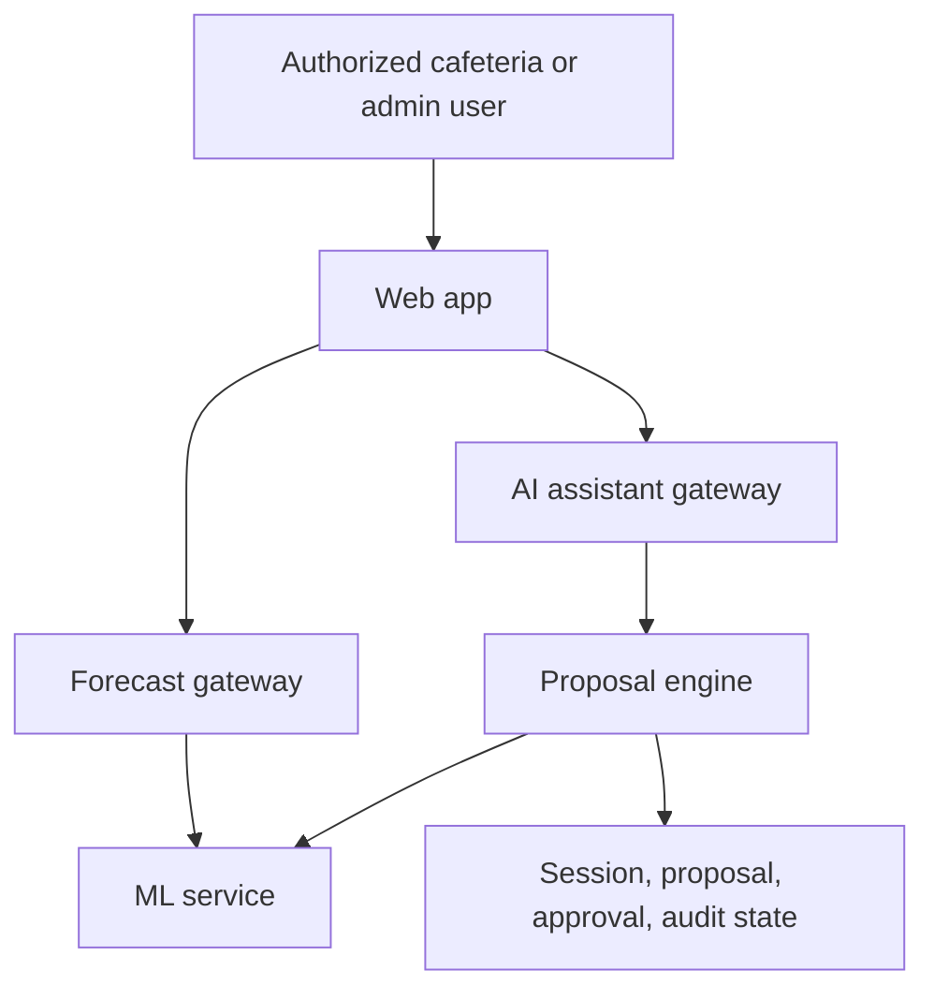
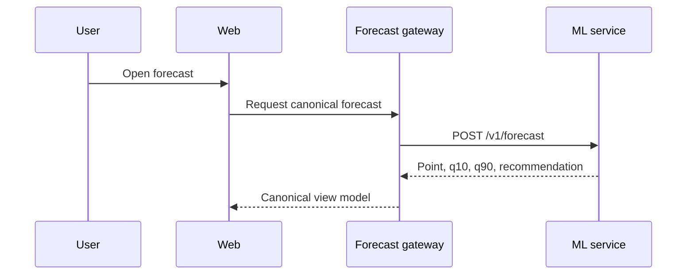
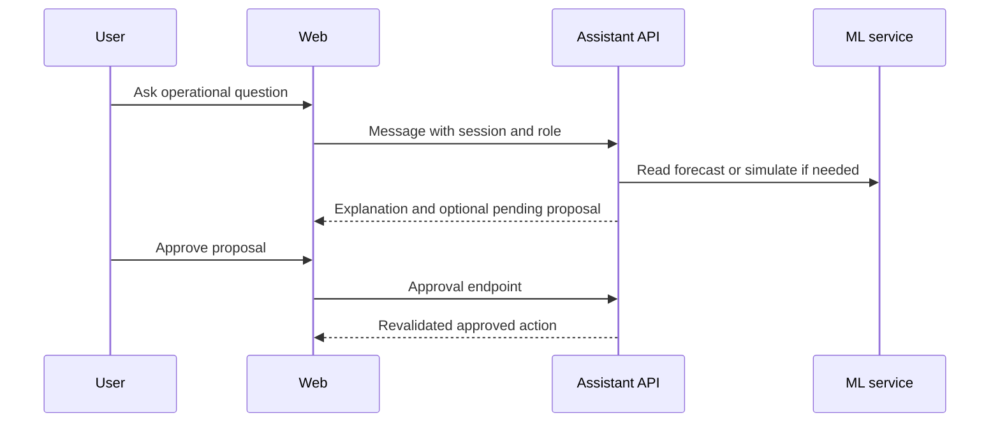

# Architecture

## System Context

SurplusSync Plus has three services: a TanStack Start web app, a secured AI assistant proposal service, and a FastAPI ML service.

## Browser and Server Boundary

The browser never receives the Copilot service token, direct service credentials, or Gemini key. Browser requests go to same-origin frontend routes. The frontend server proxies forecast and assistant requests to private services.

## Forecast Flow

## AI Assistant Proposal Flow

## Approval Flow

Every consequential action goes through a human approval gate. The assistant may create pending proposals, but it cannot approve itself or execute irreversible actions.

## Partner Prerequisite Flow

Partner execution is checked against surplus confirmation, checklist completion, recovery window, eligibility, capacity where represented, role, proposal freshness, and operating mode.

## Manual Mode

Assisted mode permits explanations, simulations, and pending proposals. Strict manual mode permits explanations and simulations but blocks executable proposals and approval execution.

## Fallback Behavior

ML fallback is disclosed when the live service is unavailable for the canonical fixture. Gemini is optional; without it the assistant uses deterministic language generation while still retrieving forecast data through the ML pathway when available.

## Audit Behavior

Operational events are append-only in the prototype store. Reset restores demo state; it does not represent production audit retention.
